# Remodel Image Enhancer

A Claude Code skill that turns raw construction / remodel / real-estate photos into
clean, listing-quality images.

## Examples

Here are some images that were enhanced by this repo. The top of each frame
is the original photo straight from a phone or jobsite camera; the bottom is
the enhanced version the skill produced — same framing, same structure, just
cleaned up, relit, and staged to a listing-grade finish.

### Why this matters for remodelers

Your craftsmanship sells the job, but a $100K deck rebuild or a gut-reno
kitchen rarely shows up that way in the photos your crew snaps on-site —
overcast skies, muddy yards, bare staging, harsh overhead light, background
clutter. Prospects scrolling your website, Instagram, or a proposal PDF see
the *photo*, not the craftsmanship. This skill takes the pictures you
already have and turns them into the versions you *wish* you had — without
reshoots, without staging days, without a photographer on retainer. More
portfolio polish, faster turnaround on proposals, more callbacks from
remodelers who can finally see what the finished space will actually feel
like. That's how better images close more jobs.

<p align="center">
  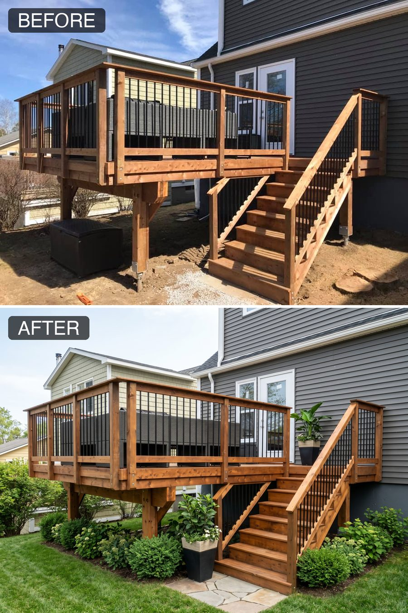<br><br>
  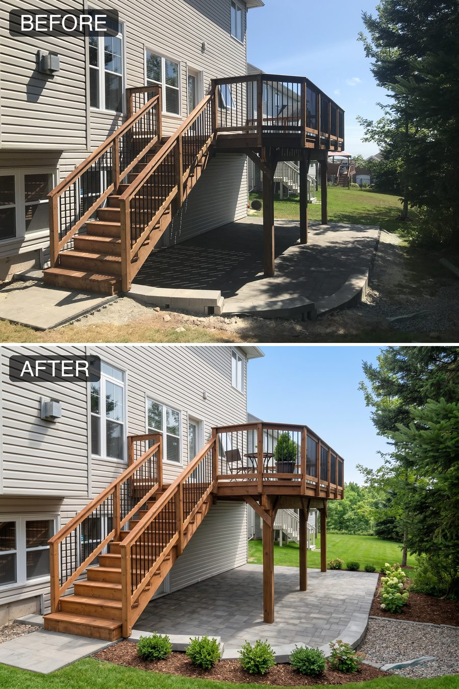<br><br>
  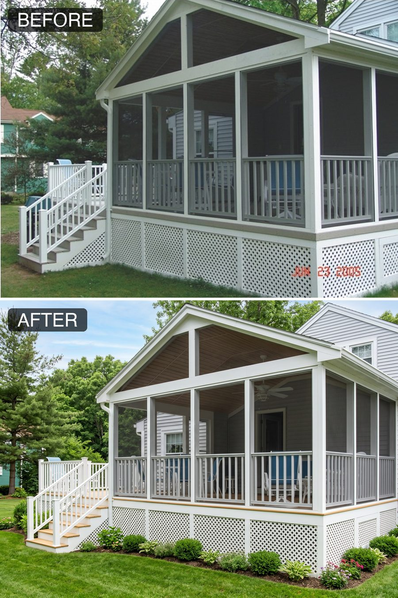<br><br>
  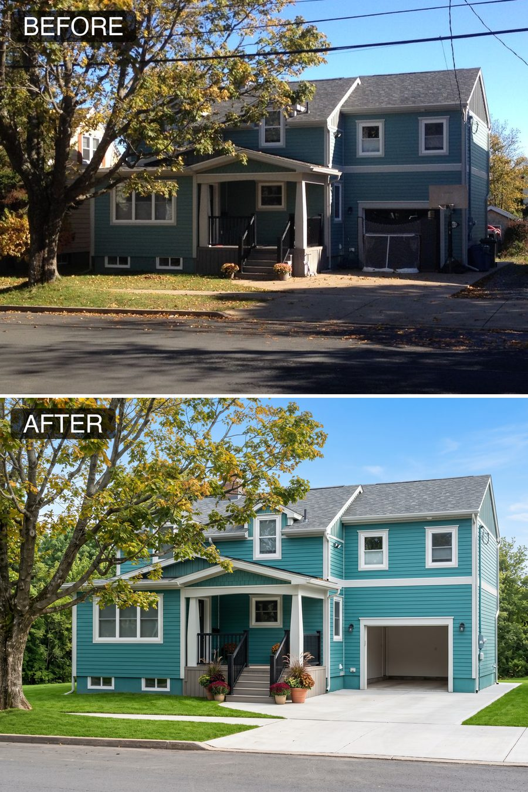<br><br>
  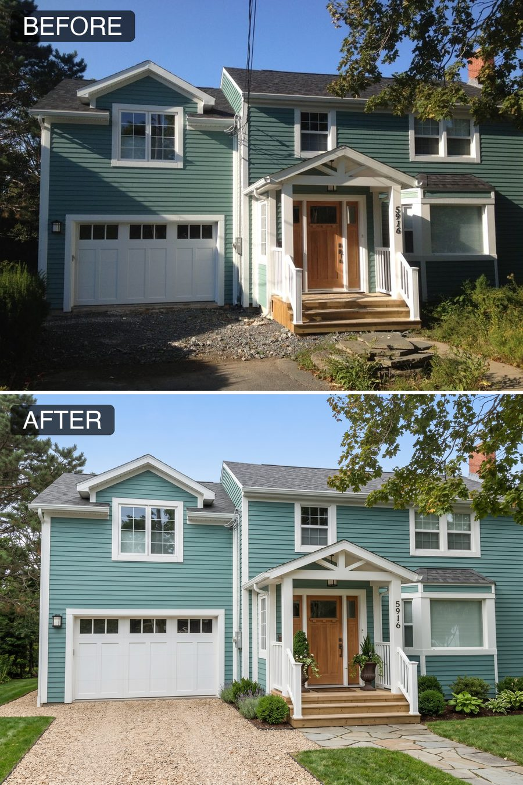<br><br>
  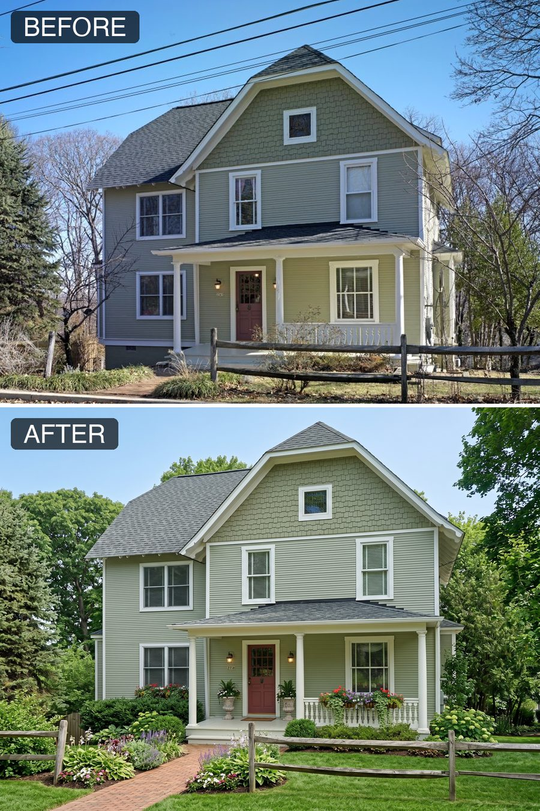<br><br>
  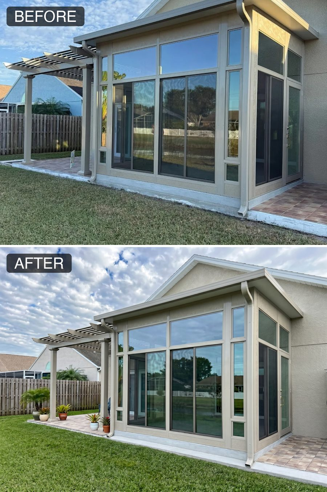<br><br>
  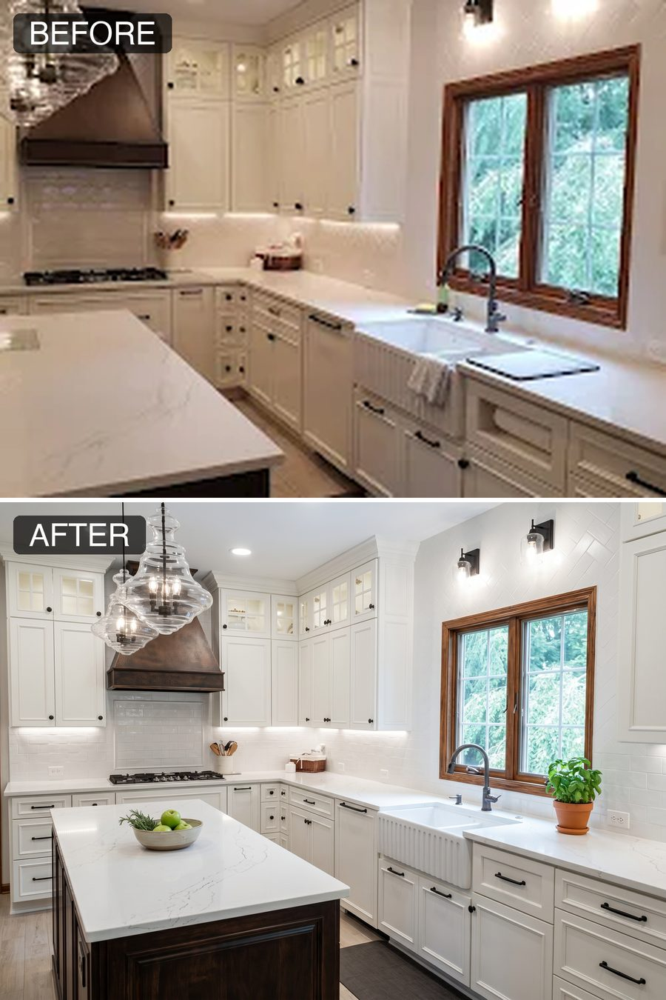<br><br>
  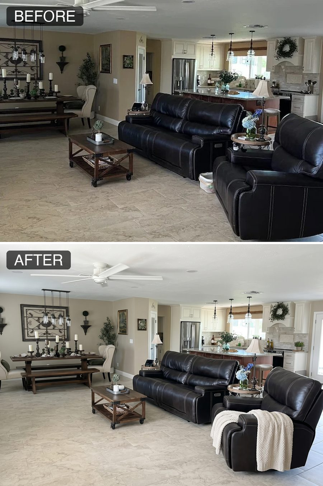<br><br>
  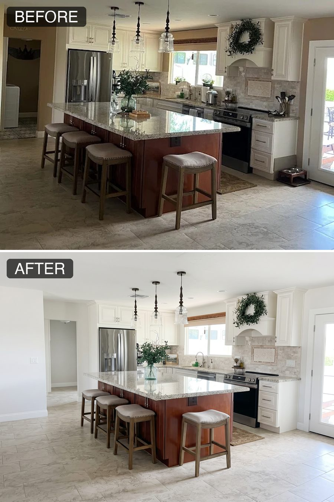<br><br>
  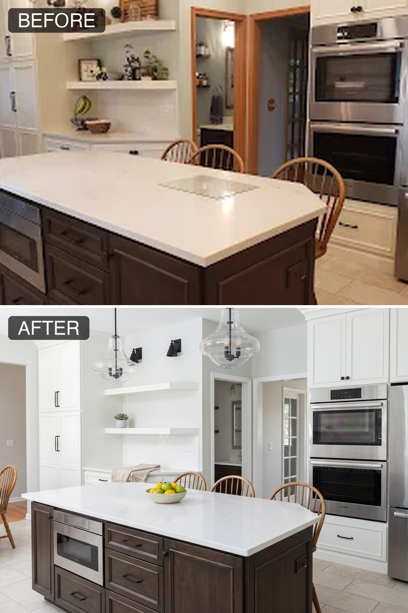
</p>

## What it does

For every image you drop into `input/`:

1. **Classifies the scene** (`kitchen`, `bathroom`, `deck`, `exterior`, etc.)
2. **Renames** the file to `{slug}_{NN}_{scene}.{ext}`, e.g. `project_01_deck.jpg`.
   Default slug is `project` — rename the folder prefix later if you want.
3. **Generates an enhancement prompt** from the structured template in
   [`.claude/skills/remodel-image-enhancer/prompts/enhancement-prompt-template.md`](.claude/skills/remodel-image-enhancer/prompts/enhancement-prompt-template.md),
   combining quick wins and major enhancements.
4. **Enhances** the image by calling fal's `fal-ai/nano-banana-2/edit` at 4:3,
   2K resolution, PNG.
5. **Saves** the result to `enhanced/{slug}_{NN}_{scene}_enhanced.png`.

No compositing, no comparisons — just clean enhanced outputs.

## Setup

### 1. Clone the repo

```bash
git clone <this-repo>
cd remodel-image-enhancer
```

### 2. Install dependencies

Requires Python 3.10+.

```bash
pip install -r requirements.txt
```

### 3. Add your API keys

Copy the example env file and fill it in:

```bash
cp .env.example .env
```

You need two keys:

| Key | Where to get it |
|---|---|
| `ANTHROPIC_API_KEY` | https://console.anthropic.com/ |
| `FAL_API_KEY` | https://fal.ai/dashboard/keys |

### 4. Install Claude Code

If you don't have it: https://claude.com/claude-code

## Usage

1. Drop your raw photos into `input/` (JPG, JPEG, PNG, WEBP — any mix).
2. From the repo root, run:

   ```bash
   claude
   ```

3. Tell Claude: *"enhance all images in input/"* (or be more specific).
4. Claude reads [`.claude/skills/remodel-image-enhancer/SKILL.md`](.claude/skills/remodel-image-enhancer/SKILL.md)
   and runs the workflow. Enhanced images land in `enhanced/`.

### Example prompts

- *"Enhance all images in input/"*
- *"Enhance only the first three images"*
- *"Enhance the kitchens using quick-wins only"*
- *"Use slug `addition_2024` when renaming"*

## Customizing behavior

Everything that controls the output lives in markdown:

- [`prompts/enhancement-prompt-template.md`](.claude/skills/remodel-image-enhancer/prompts/enhancement-prompt-template.md)
  — the structured prompt Claude builds for each image
- [`prompts/scene-classifier.md`](.claude/skills/remodel-image-enhancer/prompts/scene-classifier.md)
  — how scenes are tagged
- [`specs/fal-api.md`](.claude/skills/remodel-image-enhancer/specs/fal-api.md)
  — fal endpoint, payload, retry rules
- [`specs/naming-convention.md`](.claude/skills/remodel-image-enhancer/specs/naming-convention.md)
  — file naming rules

Edit those files and Claude will behave differently on the next run.

## Cost notes

- Anthropic: one vision call per image for classification + one call per image
  for the enhancement prompt. Haiku-tier.
- fal.ai: one enhancement per image. Pricing depends on your plan — see
  https://fal.ai/pricing.

## License

MIT (or whatever you want — change this file).
